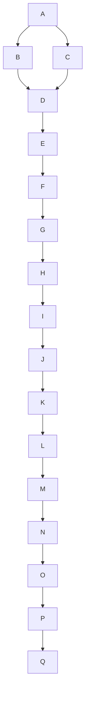

# Your Documentation

## Summary...
## Additional Info...  

```  

1. This document contains architecture specifications for the Muduo Lock-Free Steal Optimization Engine.
2. Please refer to the README file for further instructions.
