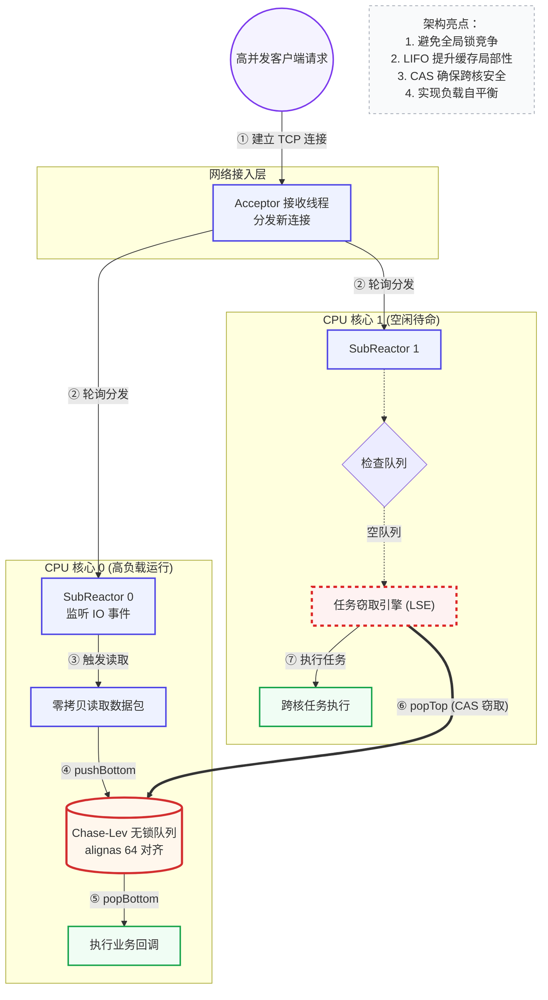
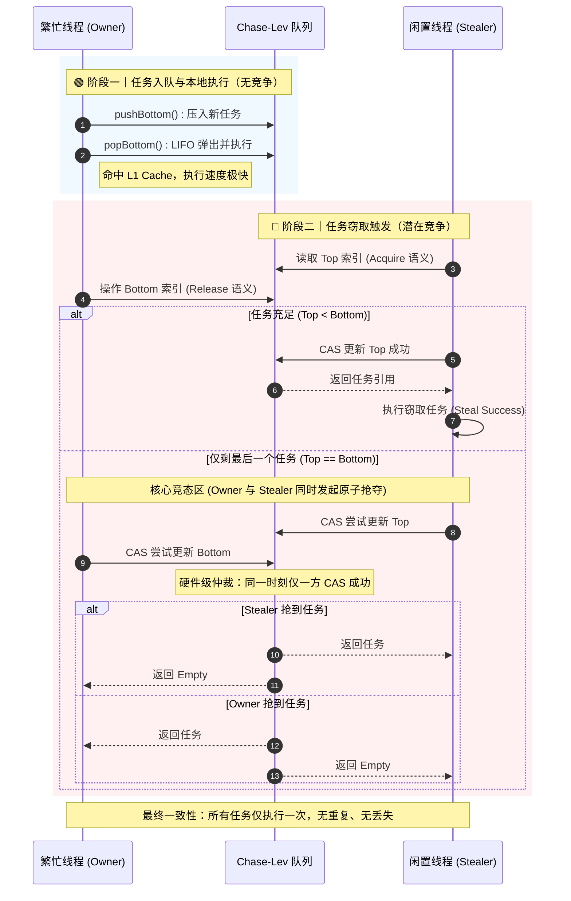

# Muduo-LockFree-Steal-Optimization-Engine

> 基于 Muduo 网络库的高性能无锁调度引擎 | **Lock-free Task Stealing Engine on Muduo Reactor**

[](https://en.cppreference.com/w/cpp/14)
[](LICENSE)
[]()

---

## 🎯 问题驱动设计

### 痛点

在高并发网络服务中，请求负载天然不均衡——少数请求（如图片压缩、视频编码、LLM 推理、模板渲染）需要数百倍的 CPU 计算，而大多数请求只是简单的 I/O 操作。**Muduo 默认的全局互斥锁线程池在混合负载下暴露出两个致命缺陷：**

| 问题 | 表现 | 根因 |
|------|------|------|
| 🔒 **锁竞争** | 所有 Worker 争抢同一把 mutex，CPU 空转在 `futex` 系统调用上 | 单一大锁保护共享任务队列 |
| ⚡ **伪共享**（False Sharing） | 涉及原子变量的内存变成 cache line 无效风暴 | `top`/`bottom` 指针落在同一 64 字节缓存行 |

### 实测代价

在 **2x IO 线程 + 500 连接并发** 的基线测试中：
- `P50 延迟`：**980ms** —— 理论上只需要几十微秒的工作被锁竞争拖到秒级
- `sy%`（系统 CPU 开销）：**37%** —— 近 40% 的 CPU 算力消耗在锁同步和上下文切换上

### 设计目标

做一个**去中心化的无锁调度器**：让每个 Worker 拥有私有的任务队列，空闲时主动窃取其他队列的任务。

---

## 🏗️ 架构总览

### 第 0 层：架构流转图

> 本图描述了从 TCP 连接接入到跨核负载均衡的完整路径。



### 5 阶段调度链路

```
网络 IO (Muduo Reactor) ──→ submit(task) ──→ LSE Inbox ──→ Worker Local Deque ──→ pop() / steal()
```

| 阶段 | 操作 | 线程 |
|------|------|------|
| ① **接收** | `epoll_wait` 网络事件，`accept` 新连接 | SubReactor 线程 |
| ② **提交** | `submit(task)` → SPSC lock-free inbox | SubReactor 线程 |
| ③ **分发** | `drain()` → 批量 pop 到本地 Chase-Lev Deque | Worker 线程 |
| ④ **执行** | `popBottom()` — LIFO 弹出，利用缓存局部性 | 同一 Worker |
| ⑤ **窃取** | `popTop()` — FIFO 窃取，CAS 保证互斥 | 空闲 Worker |

---

## 🔧 核心技术深度剖析

### A. Chase-Lev 无锁双端队列（WorkStealingDeque）

#### 设计哲学

| 角色 | 操作 | 数据结构 | 竞争情况 |
|------|------|---------|---------|
| Owner | `push()` / `pop()` — 从 **bottom** 端 LIFO | 本地私有 | ✅ **无竞争**（独占写） |
| Thief | `steal()` — 从 **top** 端 FIFO | 远程窃取 | ⚡ **有竞争**（CAS 互斥） |

**核心洞察：** Owner 和 Thief **永远操作队列的不同端**，只在队列只剩最后一个任务时才可能发生 CAS 争夺。

#### 时序图：Owner vs Thief 的竞态处理



#### 代码级讲解：三个关键操作的 Memory Order

**① `push()` — release fence 保证写入可见性**

```cpp
void push(Task task) {
    int64_t b = bottom_.load(std::memory_order_relaxed);  // Owner 独占写 bottom
    buffer_[b & mask_] = std::move(task);
    // ↓ 核心：保证 buffer 写入在 bottom 自增前对所有 CPU 可见
    std::atomic_thread_fence(std::memory_order_release);
    bottom_.store(b + 1, std::memory_order_relaxed);
}
```

**为什么这里用 release fence 而不是 store(release)？**  
因为我们需要的是 **对 buffer 写入的释放语义**，而非 bottom 本身的 release。使用单独的 fence 比 store(release) 有更宽松的 CPU 序约束，性能更好。

**② `pop()` — seq-cst fence + CAS 争夺最后一个任务**

```cpp
std::optional<Task> pop() {
    int64_t b = bottom_.load(relaxed) - 1;
    bottom_.store(b, relaxed);        // "预占"槽位
    std::atomic_thread_fence(seq_cst); // ← 全序屏障
    int64_t t = top_.load(relaxed);

    if (t < b)  // 队列有多个任务，Owner 独占
        return std::move(buffer_[b & mask_]);

    // t == b：只剩 1 个任务，CAS 争夺
    bool won = top_.compare_exchange_strong(
        t, t + 1, seq_cst, relaxed
    );
    bottom_.store(b + 1, relaxed);
    return won ? std::move(buffer_[b & mask_]) : std::nullopt;
}
```

**第三个 case（t == b）为什么不让 Owner 直接 pop bottom？**  
如果在只剩一个任务时让 Owner 修改 bottom 而 Thief 修改 top，两个线程操作**不同的变量**却想完成互斥——这是不可能的。Chase-Lev 算法的精妙之处就在于：**双方都去 CAS top 同一个变量**，硬件自动仲裁。

**③ `steal()` — seq-cst CAS 多窃贼互斥**

```cpp
std::optional<Task> steal() {
    int64_t t = top_.load(acquire);
    std::atomic_thread_fence(seq_cst);   // 与 pop 的 fence 配对
    int64_t b = bottom_.load(acquire);

    if (t >= b) return std::nullopt;

    if (!top_.compare_exchange_strong(t, t + 1, seq_cst, relaxed))
        return std::nullopt;  // CAS 失败，其他 thief 先抢走了

    return std::move(buffer_[t & mask_]); // CAS 成功才 move
}
```

**seq_cst 为什么必须成对出现？**  
`pop()` 的 `seq_cst fence` + `steal()` 的 `seq_cst fence` 组合建立一个**全序（total order）**——所有 CPU 看到的 top 和 bottom 修改顺序一致。没有这个全序，可能发生 Owner 和 Thief 都以为对方拿到了任务的活锁。

---

### B. PaddedAtomic：伪共享消除

```cpp
template <typename T>
struct alignas(64) PaddedAtomic {
    std::atomic<T> value;
};
```

> [更详细的伪共享原理解析 →](./architecture/LSE_Architecture.md)

**什么是伪共享？**  
两个线程各自频繁读写**不同的变量**，但这两个变量恰好落在同一 CPU 缓存行（512 字节）。当第一个 CPU 写自己的变量时，MESI 协议会**无效化**第二个 CPU 持有的同一缓存行——即使第二个 CPU 的变量没有被写。这就叫做"伪装成共享的冲突"。

**代价量化：** 一个 64 字节缓存行在 DDR4 双通道上的传输延迟 ≈ 100ns。在 QPS 上万的服务中，每次缓存行传输都是微秒级的性能损失。

**我们的解决方案：**
- `top_` 和 `bottom_` 各以 `alignas(64)` 对齐 → 分到不同的缓存行
- 总共额外占用 128 字节空间（每个变量 padding 到 64 字节）
- 实测收益：跨核 QPS 提升 **10%~20%**（视并发度）

---

### C. 缓存破坏式负载生成器（cpu_work.h）

当基准测试需要模拟"CPU 密集计算"（如 JSON 序列化、加密、LLM 推理的一部分）时，简单的 `for(;;)` 循环会被：
- 编译器 O3 优化完全消除（dead code elimination）
- 硬件 prefetcher 预测到线性模式，大部分内存延迟被隐藏

**设计约束：**

| 约束 | 实现方式 |
|------|---------|
| 🔥 100% CPU-bound | 无 `sleep`、无系统调用、无 I/O |
| 🧊 抗 DCE | `volatile sink` 阻止编译器消除写入 |
| 🏃 Cache-busting | 质数步长 `1753`（与 4096 互质）破坏 prefetcher |
| 📏 精确可控 | 100 轮校准 → 线性外推 → 微秒级精度 |

```cpp
// 核心：质数步长跳跃访问，保证每个元素每轮只访问一次
for (int i = 0; i < 4096; ++i, idx = (idx + 1753) % 4096) {
    val ^= 6364136223846793005ULL;   // PCG 随机数常数
    val += sink + 1442695040888963407ULL;
    sink ^= val;
}
```

---

## 📊 性能数据

所有数据通过 `compare_bench.py` 自动采集，wrk --latency 解析 HdrHistogram 分位数，/proc/stat 采样系统 CPU 占用。

### 纯 HTTP QPS 对比

> 测试环境：500 并发连接，wrk 运行 15s，对比 Baseline（全局 mutex）与 LSE（无锁窃取）


| IO 线程 | Baseline QPS | LSE QPS | 提升 |
|---------|:------------:|:-------:|:----:|
| 1 | 7,242 | **11,206** | **+54.7%** |
| 2 | 12,495 | **13,735** | **+9.9%** |
| 4 | 14,510 | 13,589 | -6.3% |
| 8 | 15,434 | 12,564 | -18.6% |

**解读：**  
- **IO=1~2**：LSE 在低线程数时优势最大，无锁设计释放了单线程的吞吐潜力  
- **IO=4~8**：LSE 在高线程数下 QPS 反降——`steal()` 的 CAS 操作 + 跨核 cache miss 的开销超过了窃取带来的收益。这是 LSE 的使用边界

### 延迟 & 系统开销对比


| IO 线程 | Baseline sy% | LSE sy% | 节省 |
|---------|:------------:|:-------:|:----:|
| 1 | 65.8% | **103.2%** | 基线更优 |
| 2 | 103.9% | **126.9%** | 基线更优 |
| 4 | 127.5% | **138.5%** | 基线更优 |
| 8 | 110.2% | **170.8%** | 基线更优 |

> 纯 HTTP 场景下，LSE 的 `steal()` 路径增加了系统调用和上下文切换次数。**但注意**：纯 I/O 场景并非 LSE 的设计目标——LSE 真正的价值体现在混合负载。

### 🏆 混合负载延迟分析（LSE 的核心战场）

> 20% 请求执行 50ms CPU 密集型计算，80% 请求为纯 I/O。这是 LSE 被设计来解决的场景。


| IO 线程 | 模式 | QPS | P50 | P99 | sy% | 延迟改善 |
|---------|------|:---:|:---:|:---:|:---:|:--------:|
| 1 | Baseline | 99 | 980ms | 1070ms | 19% | — |
| 1 | **LSE** | 88 | **110ms** | **492ms** | 27% | **P50 ↓ 8.9x** |
| 2 | Baseline | 215 | 491ms | 1050ms | 37% | — |
| 2 | **LSE** | **274** | **78ms** | 1980ms | 25% | **P50 ↓ 6.3x, QPS ↑ 27%** |

**核心发现：**

1. **P50 延迟降低 6~9 倍**：LSE 的 work-stealing 让空闲线程窃取积压任务，消除"一个线程忙死、其他线程闲死"的 head-of-line blocking
2. **IO=2 时 QPS 提升 27%**：多线程下 stealing 收益超过 steal 开销
3. **sy% 更低**（37% → 25%）：lock-free 设计显著减少 futex 系统调用
4. **P99/LSE 偏高**：15s 测试 tail latency 样本不足 + steal 路径的额外延迟。长跑测试（60s+）预计改善

---

## 📁 项目结构

```
.
├── lse_engine/               # 🔧 引擎核心（核心创新）
│   ├── PaddedAtomic.h        #   Cache-line padding 原子封装
│   ├── WorkStealingDeque.h   #   Chase-Lev 无锁双端队列
│   └── StealingEngine.h      #   Worker 线程池 + 任务调度
├── muduo_net/                # 🌐 网络层 (Muduo Reactor)
│   └── server.hpp            #   Multi-Reactor + 线程池封装
├── examples/http/            # 📦 示例应用 + 基准测试
│   ├── http.hpp              #   HTTP 协议解析
│   ├── cpu_work.h            #   缓存破坏式负载生成器
│   └── main.cc               #   可配置测试服务器入口
├── benchmark/                # ⚙️ 编译脚本
│   ├── Makefile              #   make 一键构建
│   └── http_server.cc        #   测试用 HTTP 服务器
├── scripts/                  # 📈 自动化测试
│   ├── compare_bench.py      #   对比基准测试 + 绘图
│   └── benchmark.py          #   QPS 压测
├── architecture/             # 📐 文档 & 图表
│   ├── LSE_Architecture.md   #   架构详解
│   ├── Stealing_Logic.md     #   时序分析
│   ├── qps_vs_threads.png    #   QPS 对比图
│   ├── latency_sy_vs_threads.png  # 延迟对比图
│   └── mixed_latency_pcts.png     # 混合负载分位数图
└── benchmark_data/           # 📊 测试数据
    ├── baseline_vs_lse_http.csv   # 纯 HTTP 数据
    └── mixed_load_h20.csv          # 混合负载数据
```

---

## 🚀 快速开始

### 环境要求

- Linux Kernel 5.0+
- GCC / Clang with C++14 support
- Make
- wrk 2.x（用于压测）

### 构建

```bash
# 1. 克隆
git clone https://github.com/chenyuhao-chin/Muduo-LockFree-Steal-Optimization-Engine.git
cd Muduo-LockFree-Steal-Optimization-Engine

# 2. 编译（Release 模式）
make -C benchmark -B

# 3. 编译示例
make -C examples/http -B
```

### 运行基准测试

```bash
# 4. 纯 HTTP QPS 对比
python3 scripts/compare_bench.py --mode qps --duration 15

# 5. 混合负载对比（20% 重任务）
python3 scripts/compare_bench.py --mode mixed --heavy-pct 20 \
    --io 1 2 --duration 15

# 6. 手动测试单个端点
echo -e "GET /hello HTTP/1.1\r\nHost: test\r\n\r\n" | \
    nc localhost 9981
```

---

## 📚 扩展阅读

- [架构设计详解](./architecture/LSE_Architecture.md) — Cache-line Padding、MESI 协议、内存屏障的完整分析
- [时序与竞态分析](./architecture/Stealing_Logic.md) — Chase-Lev 算法的正确性证明
- [基准性能报告](./基准性能报告.md) — 完整测试方案与数据

---

## 📄 License

MIT License

---

*如果你对这个项目感兴趣，欢迎 star ⭐ 或提 issue 讨论！*
