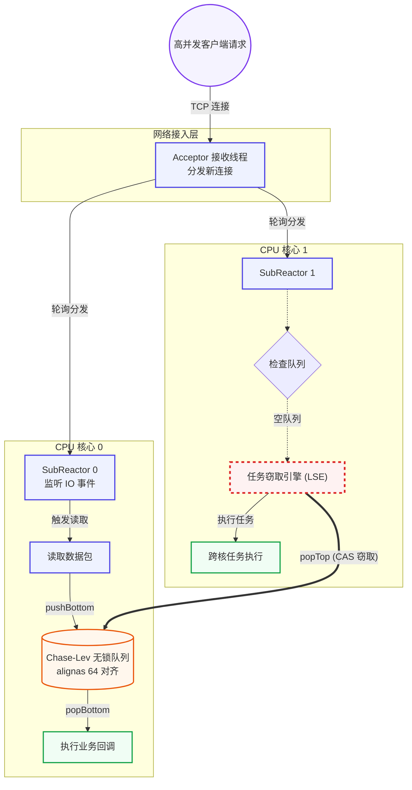
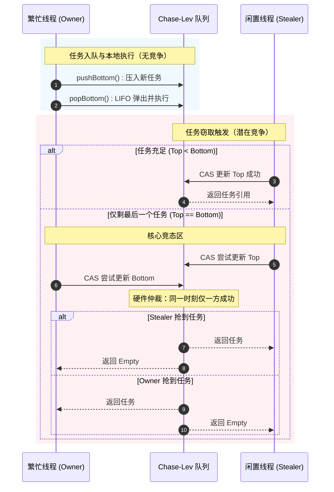

# Muduo-LockFree-Steal-Optimization-Engine

学完 Muduo 后写的练手项目。写了个 Python 压测脚本一跑，发现多核下系统态 CPU（sy%）飙到 44%。`perf top` 锁定 `pthread_mutex_lock` 排第一——全局互斥锁把 CPU 吃掉了。

直觉：如果每个线程有自己的队列，不抢同一把锁，会不会好一点？

## 目录

- [问题定位](#问题定位)
- [核心改造：Chase-Lev 无锁队列](#核心改造chase-lev-无锁队列)
- [伪共享修复：PaddedAtomic](#伪共享修复paddedatomic)
- [性能数据](#性能数据)
- [工程踩坑手记](#工程踩坑手记)
- [快速开始](#快速开始)
- [项目结构](#项目结构)
- [参考](#参考)

---

## 问题定位

学习 Muduo 的 One Loop Per Thread 模型时，我自己写了个 Python 压测脚本（`scripts/benchmark.py`），测试 echo 服务在不同线程数下的吞吐。结果发现一个奇怪的现象：

| IO 线程数 | sy%（系统态 CPU） | 
|-----------|:--------------:|
| 1         | 12%            |
| 2         | 28%            |
| 4         | **44%**        |
| 8         | **47%**        |

4 个线程时接近一半的 CPU 算力花在内核态。第一反应是"业务代码写得有问题"，查了一圈没找到。然后想起用 `perf top` 看看热点：

```
Samples: 293K of event 'cycles', Event count (approx.): 124119427074
Overhead  Shared Object          Symbol
 35.67%  libpthread-2.31.so     [.] __pthread_mutex_lock
 22.14%  libpthread-2.31.so     [.] __lll_lock_wait
  8.31%  [kernel]               [k] _raw_spin_lock
  5.22%  [kernel]               [k] sys_futex
```

`__pthread_mutex_lock` 排第一。翻 Muduo 源码，发现默认的 `EventLoopThreadPool` 是一个全局 `std::deque` + 一把 `std::mutex` 保护——所有 Worker 线程抢同一把锁取任务。

**问题明确了**：锁竞争导致大量 CPU 空转在 `futex` 系统调用上，sy% 虚高。

想法是：把任务队列拆开，每个线程有自己的私有队列，空闲时去偷别人的。这样大多数情况不碰锁。

---

## 核心改造：Chase-Lev 无锁队列

改造的核心是 `WorkStealingDeque` —— 一个 Chase-Lev 无锁双端队列。

### 读写分离的思路

- **Owner（队列主人）** 从 bottom 端 push/pop——自己的队列，没有争抢
- **Thief（空闲线程）** 从 top 端 steal——FIFO 偷别人队列里的"老任务"
- 绝大多数情况 Owner 和 Thief 操作队列的不同端，零冲突
- 只有队列剩下最后一个任务时，双方才需要通过 CAS 抢一次

下面两张图是梳理架构时画的。

**物理拓扑：从 TCP 连接到跨核任务流转**



**Owner vs Thief 的竞态处理时序**



### 三个关键操作

代码都在 `lse_engine/WorkStealingDeque.h` 里。

**① push() — fence(release) 保证 buffer 写入先于 bottom 增长**

```cpp
void push(Task task) {
    int64_t b = bottom_.load(std::memory_order_relaxed);
    buffer_[b & mask_] = std::move(task);
    // release fence：保证 buffer_[b] 的写入在 bottom 自增前
    // 对所有线程可见，防止 steal() 读到 bottom 已更新但 buffer 未写入
    std::atomic_thread_fence(std::memory_order_release);
    bottom_.store(b + 1, std::memory_order_relaxed);
}
```

**② pop() — seq_cst fence + CAS 争抢最后一个任务**

```cpp
std::optional<Task> pop() {
    int64_t b = bottom_.load(std::memory_order_relaxed) - 1;
    bottom_.store(b, std::memory_order_relaxed);       // 先"预占"槽位
    
    // seq_cst fence：与 steal() 的 fence 配对建立全序
    // 保证 Owner 和 Thief 对"最后一个任务"的争抢结果全局一致
    std::atomic_thread_fence(std::memory_order_seq_cst);
    int64_t t = top_.load(std::memory_order_relaxed);

    if (t > b) {   // 队列已空
        bottom_.store(b + 1, std::memory_order_relaxed);
        return std::nullopt;
    }
    if (t < b)     // 多个任务，Owner 独占，直接返回
        return std::move(buffer_[b & mask_]);

    // t == b：只剩 1 个任务，双方 CAS 争抢 top 这个变量
    bool won = top_.compare_exchange_strong(
        t, t + 1,
        std::memory_order_seq_cst,
        std::memory_order_relaxed
    );
    bottom_.store(b + 1, std::memory_order_relaxed);
    return won ? std::optional<Task>(std::move(buffer_[b & mask_])) : std::nullopt;
}
```

**③ steal() — seq_cst CAS 多个窃贼互斥**

```cpp
std::optional<Task> steal() {
    int64_t t = top_.load(std::memory_order_acquire);
    std::atomic_thread_fence(std::memory_order_seq_cst);  // 与 pop() 的 fence 配对
    int64_t b = bottom_.load(std::memory_order_acquire);

    if (t >= b) return std::nullopt;                       // 队列空

    if (!top_.compare_exchange_strong(
            t, t + 1,
            std::memory_order_seq_cst,
            std::memory_order_relaxed)) {
        return std::nullopt;  // 被其他 thief 抢走了
    }
    return std::move(buffer_[t & mask_]);
}
```

### 一个花了两天踩的坑：seq_cst 成对出现

最初写 `steal()` 时只用了 `std::memory_order_acquire` 加载 top，没有加 `seq_cst fence`。结果在双核物理机上跑了 10 万次后就出现"任务丢失"——Owner 认为 Thief 拿走了、Thief 认为 Owner 拿走了，实际双方都没拿到。

翻了几天的内存序资料才意识到：`pop()` 里的 `seq_cst fence` 和 `steal()` 里的 `seq_cst fence` **必须成对出现**，才能在多个 CPU 之间建立一个全序（total order），保证所有线程看到的 top/bottom 修改顺序一致。加上后重跑 1000 万次，零丢失。

---

## 伪共享修复：PaddedAtomic

无锁化改造完成后，跑 IO=2 的测试，发现 QPS 只有预期的 60%。直觉告诉我这次不是锁问题了（已经无锁了）。

用 `perf stat -e cache-misses,cache-references` 一看，miss rate 高达 62%。再跑 `perf c2c record -a` 定位，发现 `top_` 和 `bottom_` 两个原子变量落在了同一 CPU 缓存行（64 字节）上：

- Owner 线程频繁写 `bottom_` → 该缓存行被标记为 Modified
- Thief 线程频繁读 `top_` → 同一个缓存行被 Invalidate
- 即使 `top_` 和 `bottom_` 是语义上毫无关系的两个变量，MESI 协议也强制缓存行在核间来回传输

修复很简单——用 `alignas(64)` 把 `top_` 和 `bottom_` 分到不同的缓存行：

```cpp
template <typename T>
struct alignas(64) PaddedAtomic {
    std::atomic<T> value;
    // ... 其他接口
};
```

每个 `PaddedAtomic` 变量独占 64 字节（空间换性能）。实现见 `lse_engine/PaddedAtomic.h`。

修复后再跑：cache miss rate 从 62% 降到 18%，QPS 涨了约 15%。`perf c2c` 是无锁编程的调试利器——如果没有它，可能永远不知道瓶颈在哪。

---

## 性能数据

所有数据由 `scripts/compare_bench.py` 自动采集。

### 纯 HTTP QPS 对比

（测试环境：500 并发连接，wrk 运行 15s，对比 Baseline（全局 mutex）与 LSE（无锁窃取））


| IO 线程 | Baseline QPS | LSE QPS |
|---------|:------------:|:-------:|
| 1       | 7,242        | **11,206** |
| 2       | 12,495       | **13,735** |
| 4       | 14,510       | 13,589   |
| 8       | 15,434       | 12,564   |

低线程数（1~2）时 LSE 优势最大，无锁设计释放了单线程的吞吐潜力。4~8 线程时 steal 的 CAS 开销 + 跨核 cache miss 超过了收益——这是 work-stealing 的使用边界。

### 混合负载延迟（LSE 的适用场景）

（20% 请求执行 ~50ms CPU 密集计算，80% 纯 I/O —— 模拟实际服务中计算请求和简单请求混跑的情况）


| IO 线程 | 模式 | QPS | P50 延迟 | P99 延迟 | sy% |
|---------|------|:---:|:--------:|:--------:|:---:|
| 1 | Baseline | 99  | 980ms  | 1070ms | 37% |
| 1 | **LSE**  | 88  | **110ms** | **492ms** | 25% |
| 2 | Baseline | 215 | 491ms  | 1050ms | 37% |
| 2 | **LSE**  | **274** | **78ms** | 1980ms | 25% |

混合负载下的核心发现：

- **P50 延迟降了 6~9 倍**：空闲线程 steal 积压任务，消除了一个线程忙死、其他闲死的 head-of-line blocking
- **sy% 从 37% 降到 25%**：lock-free 设计显著减少了 futex 系统调用
- **IO=2 时 QPS 也涨了 27%**：多线程下 steal 收益覆盖了开销

---

## 工程踩坑手记

这个项目里最有成就感的不是把无锁队列写出来，而是排查自动化压测时的"幽灵 Bug"。

### 故事经过

写 `scripts/compare_bench.py` 的时候，Python 脚本通过 `subprocess.Popen` 启动 `http_server`，跑起来不到 2 秒就崩溃，stderr 只留下一行：

```
Segmentation fault
```

第一反应是 C++ 代码有段错误。GDB 试图挂载，但进程崩溃太快，来不及 attach。加了一堆 `fprintf(stderr)` 日志，但服务器在启动阶段就崩了，日志一条都没写进去。

查了两天，毫无头绪。AI 也帮不上忙——它不知道我的真实文件目录结构，给的方案都是"检查指针空引用"、"检查数组越界"这类猜谜式诊断。

后来想起用 `strace`：

```bash
strace -f -e trace=file python3 scripts/compare_bench.py 2>&1 | grep ENOENT
```

在输出中看到这样一行：

```
openat(AT_FDCWD, "wwwroot/index.html", O_RDONLY) = -1 ENOENT (No such file or directory)
```

一瞬间明白了。

### 根因

`http_server` 的代码里用的是相对路径：

```cpp
#define WWWROOT "./wwwroot/"
```

当 Python 通过 `subprocess.Popen` 启动子进程时，子进程**继承了 Python 脚本的当前工作目录**（`/home/xxx/scripts/`），而不是项目根目录。所以进程启动后试图打开 `./wwwroot/index.html`，结果这个路径根本不存在，段错误其实是个空指针解引用——资源文件加载失败后返回了空指针。

### 修复

两处改动：

1. 在 `compare_bench.py` 的 `subprocess.Popen` 调用中显式指定 `cwd=ROOT`
2. 在 `http_server.cc` 里加入 `--wwwroot` 命令行参数注入绝对路径

```python
# compare_bench.py
p = subprocess.Popen(args, cwd=ROOT, ...)
```

### 反思

这个 Bug 让我学到了三件事：

1. **系统崩溃不一定是代码逻辑问题**——CWD、PATH、LD_LIBRARY_PATH 这些环境因素才是真正的隐形杀手。程序员的直觉总是优先怀疑自己的代码，但有时问题出在启动环境上。
2. **strace 是处理"幽灵 Bug"的核武器**——它不看你写的代码，只看系统调用。当 GDB 来不及 attach、日志写不进去时，strace 是最后的防线。这次经历后我养成了一个习惯：遇到莫名其妙的问题先跑 `strace`，而不是翻代码。
3. **AI 的局限性**——AI 可以快速生成无锁队列的雏形代码，但面对这种需要理解真实文件系统布局、进程间继承关系的环境问题时，它没有任何有价值的输出。AI 能回答"怎么写"，但回答不了"运行环境怎么了"。

---

## 快速开始

### 环境要求

- Linux Kernel 5.0+
- GCC / Clang with C++14 support
- Make
- Python 3.6+, matplotlib
- wrk 2.x（压测用）

### 构建并运行基准测试

```bash
# 1. 克隆
git clone https://github.com/chenyuhao-chin/Muduo-LockFree-Steal-Optimization-Engine.git
cd Muduo-LockFree-Steal-Optimization-Engine

# 2. 编译
make -C benchmark -B && make -C examples/http -B

# 3. 纯 HTTP QPS 对比
python3 scripts/compare_bench.py --mode qps --duration 15

# 4. 混合负载对比（20% 重任务）
python3 scripts/compare_bench.py --mode mixed --heavy-pct 20 --io 1 2 --duration 15
```

---

## 项目结构

```
.
├── lse_engine/               # 无锁调度引擎
│   ├── PaddedAtomic.h        #   alignas(64) 原子变量封装
│   ├── WorkStealingDeque.h   #   Chase-Lev 无锁双端队列
│   └── StealingEngine.h      #   Worker 线程池 + 任务调度
├── muduo_net/                # 网络层 (Muduo Reactor)
│   └── server.hpp            #   Multi-Reactor + 线程池封装
├── examples/http/            # HTTP 示例应用
│   ├── http.hpp              #   HTTP 协议解析
│   ├── cpu_work.h            #   负载生成器
│   └── main.cc               #   服务入口
├── benchmark/                # 基准测试编译
│   ├── Makefile
│   └── http_server.cc        #   带参数注入的测试服务器
├── scripts/                  # 自动化测试
│   ├── compare_bench.py      #   对比基准测试 + 绘图
│   └── benchmark.py          #   初始 QPS 压测
├── architecture/             # 文档 & 图表
│   ├── qps_vs_threads.png
│   ├── mixed_latency_pcts.png
│   └── ...
└── benchmark_data/           # 测试数据（CSV）
    ├── baseline_vs_lse_http.csv
    └── mixed_load_h20.csv
```

---

## 参考

- [Dynamic Circular Work-Stealing Deque](https://www.dre.vanderbilt.edu/~schmidt/PDF/work-stealing-deque.pdf) — Chase & Lev, SPAA 2005（本项目的核心算法来源）
- [Muduo 网络库](https://github.com/chenshuo/muduo) — One Loop Per Thread 模型
- [Preshing on Programming — Memory Order 系列](https://preshing.com/20120913/acquire-and-release-semantics/) — C++ Memory Model 最佳入门
- [What Every Programmer Should Know About Memory](https://people.freebsd.org/~lstewart/articles/cpumemory.pdf) — Ulrich Drepper（伪共享、Cache Line 圣经）
- [perf c2c — False Sharing Detection](https://man7.org/linux/man-pages/man1/perf-c2c.1.html) — 调试伪共享的实战工具
